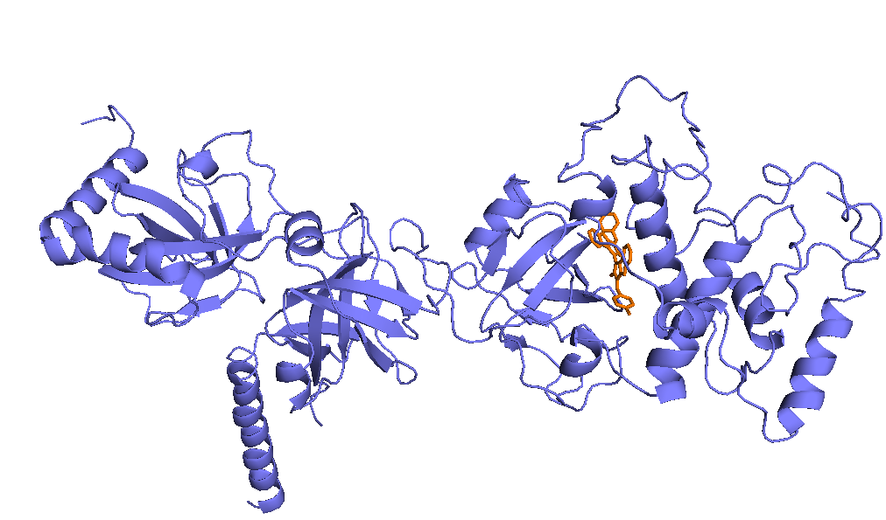
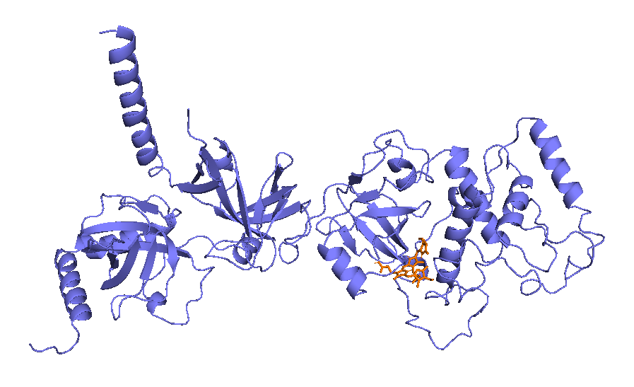
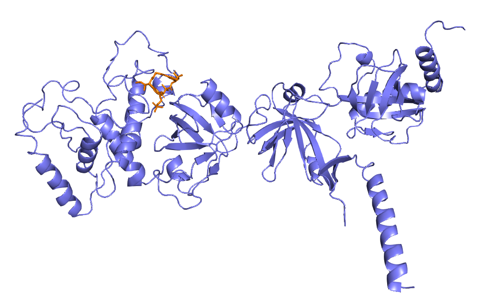
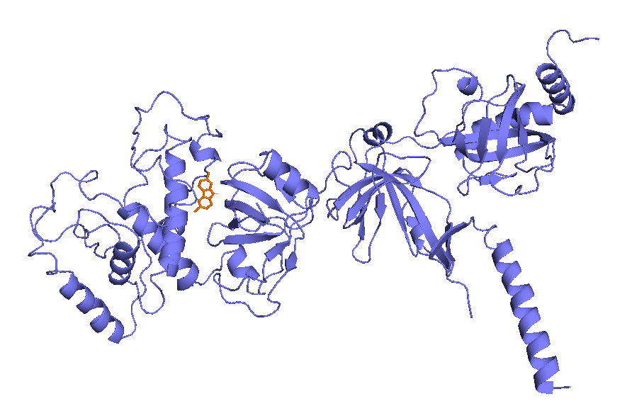
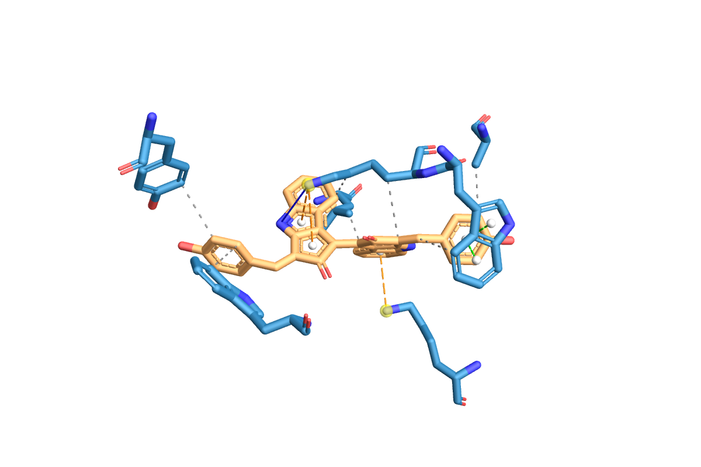
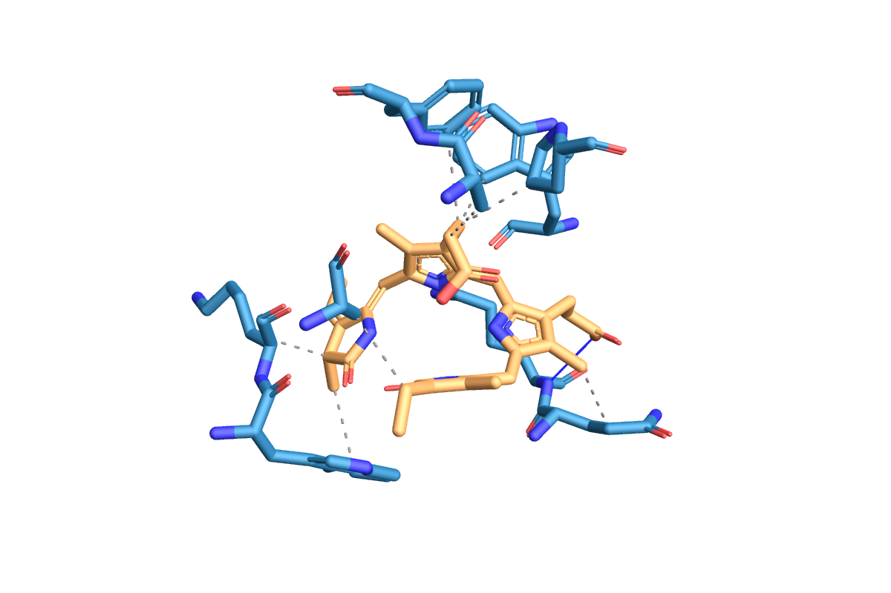
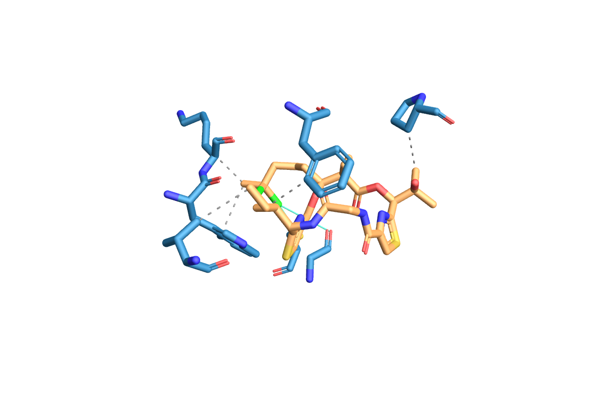
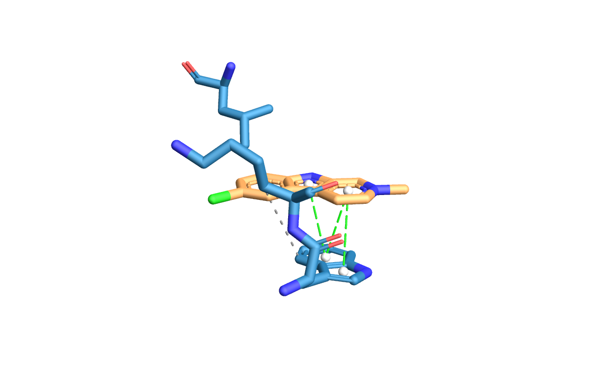

# Molecular Docking and ADMET Profiling of Cyanobacterial Natural Products Against the BRCA2 DNA-Binding Domain
This repository contains an end-to-end, fully GUI/web-based **molecular docking and ADMET profiling pipeline** to screen four cyanobacterial natural products for binding to the DNA-binding domain (DBD) of **BRCA2**, a tumour-suppressor protein central to homologous-recombination (HR) DNA repair. Because no experimental crystal structure of the human BRCA2 DBD exists, the pipeline uses a **dual-receptor strategy** — the experimental mouse ortholog [1MJE](https://www.rcsb.org/structure/1MJE) and a human homology model built from that same template via [SWISS-MODEL](https://swissmodel.expasy.org/) ([UniProt P51587](https://www.uniprot.org/uniprotkb/P51587/entry)). The four test compounds — scytonemin, phycocyanobilin, lyngbyabellin A, and nostocarboline — are secondary metabolites from cyanobacterial genera *Nostoc*, *Anabaena*, and *Lyngbya*. They are docked against the DSS1-binding pocket alongside olaparib (affinity benchmark) and caffeine (negative control) using AutoDock Vina, with interaction profiling in PLIP and pharmacokinetic and toxicity profiling in SwissADME and ADMETlab 3.0.

---

## Key Technical Implementations
- **Dual-receptor cross-species consistency check —** No experimental structure of the human BRCA2 DBD exists (every crystallised version, including 1MJE, is the mouse ortholog), and the full-length protein (3,418 residues) exceeds the AlphaFold database length limit. Docking was therefore performed against both the experimental mouse structure and a human homology model templated on it (76.4% sequence identity, QMEANDisCo Global 0.64 ± 0.05). Because the human model is built from 1MJE rather than independently derived, strong agreement between tracks is partly expected by construction — this is presented as a cross-species consistency check rather than fully independent validation. Superimposing the two structures in PyMOL gave an RMSD of **0.324 Å over 3,913 atoms**, confirming a shared coordinate frame and allowing a single grid box to target the equivalent pocket in both receptors.
- **Structure-aware receptor preparation —** The 1MJE crystal was cleaned in PyMOL by removing waters, the co-crystallised DSS1 peptide (chain B), heteroatoms, and the ssDNA chain (chain C, recorded as ATOM rather than HETATM lines, requiring explicit chain removal). Tamarind Bio's internal PDB2PQR pipeline aborts on receptors containing hydrogen atoms — a failure mode encountered during execution — so all hydrogens were stripped from the human model before upload. No local AutoDockTools or MGLTools installation was needed; Tamarind Bio handles all receptor and ligand preparation (PDB → PQR → PDBQT) internally.
- **Pocket detection validated against the known binding partner —** PrankWeb (P2Rank) predicted the binding pocket on the cleaned mouse receptor. The top-ranked pocket P1 (score 16.87, probability 0.790, 23 residues) was confirmed as the DSS1 site by measuring the distance from each pocket centre to DSS1's original crystallographic position: P1 was 7.96 Å away versus 46.19 Å for P2. The same grid box was applied to both receptor tracks without modification, enabled by the shared coordinate frame.
- **Validation without a small-molecule co-crystal —** Standard redocking validation requires a co-crystallised small molecule; the co-crystallised partner in 1MJE is DSS1, a 70-residue peptide that cannot be represented as an SDF. Three alternative checks were used instead: per-compound pocket positional checks against the grid box, negative-control discrimination against a caffeine baseline (−5.444 / −5.315 kcal/mol), and cross-receptor rank consistency (identical ordering across both tracks with only 0.02–0.67 kcal/mol track-to-track difference).
- **Olaparib as affinity benchmark, not positive control —** Olaparib is a PARP1/2 inhibitor. It works by blocking PARP-mediated single-strand break repair, which in BRCA2-deficient cells causes lethal double-strand break accumulation — synthetic lethality. It does not bind BRCA2 and has no known affinity for the BRCA2 DBD. It was included here as a comparative affinity benchmark: a clinically approved, well-characterised small molecule docked against the same site to provide a reference point. A true positive control would require a compound with experimentally confirmed BRCA2 DBD binding (e.g., a DSS1 mimetic), which is not available as a small-molecule SDF.

## Key Findings
- **Scytonemin shows the strongest predicted binding affinity on both receptor tracks, outperforming the clinical affinity benchmark olaparib.** Scytonemin scored **−10.99 kcal/mol** against the mouse receptor (1MJE) and **−11.01 kcal/mol** against the human homology model, compared to olaparib at −9.932 / −9.553 kcal/mol. All four cyanobacterial compounds maintained identical rank ordering across both tracks with differences of only 0.02–0.67 kcal/mol, supporting the robustness of the affinity results. All test compounds scored more negative than the caffeine negative control (−5.444 / −5.315 kcal/mol), distinguishing them from a non-binder across a margin of 1.56–5.55 kcal/mol.

#### Docking Affinity — All Compounds Across Both Receptors
| Compound | Role | ΔG vs 1MJE (kcal/mol) | ΔG vs BRCA2_SM (kcal/mol) | ΔΔG (SM − 1MJE) | Rank consistent? |
|----------|------|-----------------------|---------------------------|-----------------|------------------|
| **Scytonemin** | Test ligand | **−10.99** | **−11.01** | −0.02 | ✓ |
| Olaparib | Affinity benchmark† | −9.932 | −9.553 | +0.38 | ✓ |
| Phycocyanobilin | Test ligand | −9.425 | −9.081 | +0.34 | ✓ |
| Lyngbyabellin A | Test ligand | −8.903 | −8.272 | +0.63 | ✓ |
| Nostocarboline | Test ligand | −6.999 | −6.327 | +0.67 | ✓ |
| Caffeine | Negative control | −5.444 | −5.315 | +0.13 | ✓ |

ΔG = Mode 1 (best) affinity. ΔΔG negative = tighter binding on the human model; positive = slightly weaker.

†Olaparib targets PARP1/2, not BRCA2 — included as a comparative affinity reference only.

- **Scytonemin engages the P1 pocket through the richest interaction profile of the four compounds.** PLIP analysis (Track 1) revealed scytonemin combining seven hydrophobic contacts, a hydrogen bond to LYS2551, two parallel π-stacking interactions with TRP2550, and three π-cation interactions with LYS2551 and LYS2671. TRP2550 and LYS2551 were contacted by all four compounds, confirming them as the core anchor residues of the P1 pocket. Lyngbyabellin A was the only compound forming halogen bonds (via its two chlorine atoms to CYS2610 and GLY2669); phycocyanobilin made the strongest-geometry hydrogen bond (D–A 2.91 Å, donor angle 151.95°, ligand donor).

#### Binding Poses — Docked Compounds in the BRCA2 P1 Pocket (1MJE, Track 1)
<table>
  <tr>
    <td align="center"><b>Scytonemin</b><br></td>
    <td align="center"><b>Phycocyanobilin</b><br></td>
  </tr>
  <tr>
    <td align="center"><b>Lyngbyabellin A</b><br></td>
    <td align="center"><b>Nostocarboline</b><br></td>
  </tr>
</table>

#### PLIP Interaction Diagrams — Cyanobacterial Compounds vs 1MJE (Track 1)
<table>
  <tr>
    <td align="center"><b>Scytonemin</b><br></td>
    <td align="center"><b>Phycocyanobilin</b><br></td>
  </tr>
  <tr>
    <td align="center"><b>Lyngbyabellin A</b><br></td>
    <td align="center"><b>Nostocarboline</b><br></td>
  </tr>
</table>

- **Nostocarboline is the most drug-like compound despite ranking last on binding affinity.** ADMET profiling revealed a clear trade-off between binding affinity and pharmacokinetic quality. Nostocarboline had zero Lipinski violations, high GI absorption, BBB permeability, the best bioavailability score (0.55), and the lowest synthetic-accessibility score (1.63 — easiest to synthesise) alongside the lowest toxicity probabilities across all endpoints. All four compounds show high predicted genotoxicity (≥0.981) — a critical limitation reinforcing that these are early-stage computational hits requiring experimental validation.

#### ADMET Profiling — Drug-likeness and Toxicity Across the Four Compounds
| Parameter | Scytonemin | Phycocyanobilin | Lyngbyabellin A | Nostocarboline |
|-----------|-----------|-----------------|-----------------|----------------|
| MW (g/mol) | 544.55 | 586.68 | 691.69 | 217.67 |
| Lipinski violations | 1 | 1 | 2 | 0 |
| GI absorption | Low | Low | Low | High |
| BBB permeant | No | No | No | Yes |
| Bioavailability score | 0.55 | 0.17 | 0.17 | 0.55 |
| Synthetic accessibility | 4.65 | 6.11 | 7.78 | 1.63 |
| Hepatotoxicity (prob.) | 0.970 | 0.974 | 0.931 | 0.330 |
| Carcinogenicity (prob.) | 0.876 | 0.796 | 0.948 | 0.634 |
| Genotoxicity (prob.) | 1.000 | 1.000 | 1.000 | 0.981 |

### Notes on Development
This project involved building a complete molecular docking and ADMET profiling pipeline using only web and GUI tools — no terminal, no local docking installation. Several tools failed or were unavailable during execution and required on-the-fly substitution. AutoDock Vina  was initially planned to be run through SwissDock for docking but failed due to server issues; it was replaced with Tamarind Bio, which also handles receptor and ligand preparation internally, removing the need for a local AutoDockTools installation entirely. CASTp was also inaccessible and replaced by PrankWeb (P2rank) for pocket detection.

A failure mode specific to Tamarind Bio was also discovered: the pipeline aborts when the uploaded receptor already contains hydrogen atoms, misinterpreting them as structural gaps. This required stripping all hydrogens from the human SWISS-MODEL receptor in PyMOL before upload — a step not documented anywhere in Tamarind's own guidance and identified only by inspecting the error output.

Track 2 (human receptor) pose visualization and PLIP interaction analysis were abandoned as the SWISS-MODEL output introduced alternate-conformation records that prevented PyMOL from rendering a clean cartoon representation. Rather than forcing a workaround that would compromise the quality of the figures, Track 2 was retained as affinity data only and the limitation documented explicitly. These substitutions and decisions are recorded in full in `01_methodology/BRCA2_docking_methodology.pdf`.

---

## Repository Structure

```
Molecular-Docking-and-ADMET-Profiling-of-Cyanobacterial-Natural-Products-against-BRCA2-DBD/
├── Molecular_Docking/
│   ├── 01_methodology/
│   │   └── BRCA2_docking_methodology.pdf
│   ├── 02_receptors/
│   │   ├── human_model_SM/
│   │   |   ├── BRCA2_SM.pdb
│   │   |   ├── BRCA2_clean.pdb
│   │   |   ├── RMSD_alignment.txt
│   │   |   ├── SM_results.json
│   │   |   ├── SWISS_MODEL_Results.pdf
│   │   |   └── coordinates_BRCA2_SM.txt
│   │   └── mouse_model/
│   │       ├── 1mje_clean.pdb
│   │       ├── 1mje_raw.pdb
│   │       └── rcsb_pdb_1MJE.fasta
│   ├── 03_ligands/
│   │   ├── SMILES_compounds.pdf
│   │   ├── caffeine.sdf
│   │   ├── lyngbyabellin_a.sdf
│   │   ├── nostocarboline.sdf
│   │   ├── olaparib.sdf
│   │   ├── phycocyanobilin.sdf
│   │   └── scytonemin.sdf
│   ├── 04_binding_pocket_predictions/
│   │   ├── params.txt
│   │   ├── prediction.json
│   │   ├── run.log
│   │   ├── structure.pdb_predictions.csv
│   │   └── structure.pdb_residues.csv
│   ├── 05_docking_results/
│   │   ├── [compound]_vs_[receptor]/
│   │   |   ├── ligand_out.pdb
│   │   |   ├── ligand_out.pdbqt
│   │   |   ├── ligand_out.sdf
│   │   |   ├── ligand_out_best.pdb
│   │   |   ├── ligand_vs_[receptor]_DOCKED.pdb
│   │   |   ├── log.txt
│   │   |   ├── output.log
│   │   |   ├── results-processed.csv
│   │   |   └── results.csv
|   |   └── gridbox_parameters.txt
│   ├── 06_binding_poses_visualization/
│   │   └── [compound]_binding_pose_1mje(_closeup).png
│   ├── 07_ligand_interactions/
│   │   └── [COMPOUND]_VS_1MJE_DOCKED_PROTEIN_LIG_Z_1{.png, _INTERACTIONS_REPORT.pdf}
│   ├── 08_ADMET_profile/
│   │   └── [compound]_{SwissADME,ADMETlab3}_result.pdf
│   └── 09_evaluation/
│       └── final_summary.xlsx
├── LICENSE
└── README.md
```

`05_docking_results/` contains 12 subfolders — all six compounds docked against both receptor tracks. Each subfolder contains the full AutoDock Vina output: `results.csv` (nine poses with affinities and RMSD values), `log.txt` (parameters used, verified against inputs), `ligand_out_best.pdb` (top-ranked pose), and the `*_DOCKED.pdb` receptor–ligand complex used for PLIP. `09_evaluation/final_summary.xlsx` contains four sheets combining the docking, PLIP interaction, contact-residue, and ADMET data across all compounds. The step-by-step methodology is documented in `01_methodology/BRCA2_docking_methodology.pdf`.

---

## Data Acquisition

All structures and ligands are publicly available and included in this repository:

| Resource | Source | Accession / Reference |
|----------|--------|-----------------------|
| Mouse BRCA2 DBD (Track 1 receptor & homology model template) | RCSB PDB | [1MJE](https://www.rcsb.org/structure/1MJE) |
| Human BRCA2 sequence (Track 2 model target) | UniProt | [P51587](https://www.uniprot.org/uniprotkb/P51587/entry) |
| Scytonemin | PubChem | [CID 135473381](https://pubchem.ncbi.nlm.nih.gov/compound/135473381) |
| Phycocyanobilin | PubChem | [CID 5280816](https://pubchem.ncbi.nlm.nih.gov/compound/5280816) |
| Lyngbyabellin A | PubChem | [CID 10032587](https://pubchem.ncbi.nlm.nih.gov/compound/10032587) |
| Nostocarboline | PubChem | [CID 5326150](https://pubchem.ncbi.nlm.nih.gov/compound/5326150) |
| Olaparib (affinity benchmark) | PubChem | [CID 23725625](https://pubchem.ncbi.nlm.nih.gov/compound/23725625) |
| Caffeine (negative control) | PubChem | [CID 2519](https://pubchem.ncbi.nlm.nih.gov/compound/2519) |

The four cyanobacterial compounds were selected on the basis of their source genera — *Nostoc*, *Anabaena*, *Lyngbya*) — and their structural diversity: scytonemin is a fully planar aromatic pigment, phycocyanobilin a linear open-chain tetrapyrrole, lyngbyabellin A a halogenated cyclic depsipeptide, and nostocarboline a compact β-carboline alkaloid.

---

## Tools Used

This pipeline is fully GUI/web-based. The only desktop installation required is PyMOL, used for receptor cleaning, structural alignment, and binding pose visualisation.

| Tool | Purpose |
|------|---------|
| [RCSB PDB](https://www.rcsb.org/) | Receptor structure download |
| [SWISS-MODEL](https://swissmodel.expasy.org/) | Human BRCA2 homology model |
| [PyMOL](https://pymol.org/) | Structure cleaning, alignment, pose visualisation |
| [PrankWeb / P2Rank](https://prankweb.cz/) | Binding pocket detection |
| [Tamarind Bio](https://www.tamarind.bio/) | AutoDock Vina docking with internal PDB2PQR preparation |
| [PLIP](https://plip-tool.biotec.tu-dresden.de/) | Protein–ligand interaction diagrams |
| [SwissADME](http://www.swissadme.ch/) | Drug-likeness and pharmacokinetics |
| [ADMETlab 3.0](https://admetlab3.scbdd.com/) | Toxicity profiling |

---

## How to Reproduce

This is a web-based pipeline with no coding required. The complete step-by-step protocol, including all confirmed parameters, troubleshooting notes, and tool substitutions, is documented in `01_methodology/BRCA2_docking_methodology.pdf`. In outline:

1. Download `1MJE` from RCSB PDB; clean in PyMOL by removing chain B (DSS1), chain C (ssDNA — must be removed explicitly as ATOM records), heteroatoms, and waters.
2. Build the human homology model in SWISS-MODEL from UniProt `P51587` using template `1mje.1.B`; align onto the cleaned 1MJE in PyMOL (RMSD 0.324 Å); strip hydrogens before upload to Tamarind Bio.
3. Detect the P1 binding pocket with PrankWeb; confirm as the DSS1 site using geometric distance; record the grid box (`05_docking_results/gridbox_parameters.txt`).
4. Download the six ligand SDF files from PubChem using the accessions above.
5. Dock each ligand against both receptors on AutoDock Vina (Tamarind Bio) [exhaustiveness 8, box centre 27.93 / 155.71 / 62.56, size 25 × 25 × 25 Å] — 12 jobs total.
6. Visualise top poses in PyMOL and generate interaction diagrams in PLIP using the `*_DOCKED.pdb` complex files (Track 1 only).
7. Profile all four cyanobacterial compounds in SwissADME (all SMILES in one batch) and ADMETlab 3.0 (per compound).

> **Note on Track 2:** Pose visualisation and PLIP interaction analysis were not performed for the human receptor. The SWISS-MODEL output introduced alternate-conformation records that prevented PyMOL from rendering a clean cartoon representation. Track 2 is reported as affinity values only; this is documented as a project limitation.

---

## Limitations

- Docking is static and treats the receptor as rigid; results are hypothesis-generating, not predictive of true binding affinity.
- The human receptor is a homology model built from the mouse 1MJE template, so cross-track agreement is partly expected by construction — this is a consistency check, not fully independent validation.
- Redocking validation was not feasible: the co-crystallised binding partner DSS1 is a 70-residue peptide, not a small molecule, and cannot be submitted to AutoDock Vina.
- Olaparib has no known affinity for the BRCA2 DBD and was used as a comparative affinity benchmark rather than a validated positive control.
- Track 2 pose visualisation and PLIP interaction analysis were not performed due to alternate-conformation formatting issues in the SWISS-MODEL output.
- All four cyanobacterial compounds show high predicted genotoxicity (≥0.981); these are in silico predictions requiring experimental confirmation.
- No molecular dynamics simulation was performed — flagged as future work.

---

## License

This project is licensed under the MIT License — see the [LICENSE](LICENSE) file for details.
